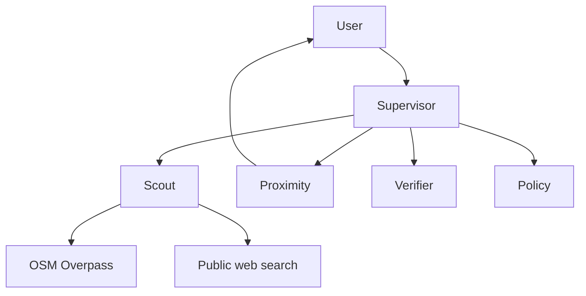

# Grok the Flock Blocker

A hackathon multi-agent toolkit for **surveillance awareness**. It finds *publicly reported* Flock / ALPR camera locations and can notify **you** (opt-in only) when you are near one.

It does **not** connect to Flock Safety, police databases, or any private system. It does **not** track other people. Opt-in GPS follow keeps coordinates in the browser only and does not save a location trail.

## Agents (LangGraph)

A supervisor routes each request to specialist agents:

| Agent | Job |
| --- | --- |
| **Scout** | Search the public web (news, FOIA coverage, city reporting) and query OpenStreetMap via the Overpass API for nodes tagged `surveillance:type=ALPR`. |
| **Proximity** | Given your opted-in coordinates, measure distance to mapped cameras and write an awareness notice **to you**. |
| **Verifier** | Score records: OSM + manufacturer tag = higher confidence; city-level news pins = low. |
| **Policy** | Summarize public reporting on ALPR retention, data-sharing, and local debate. |



If `OPENAI_API_KEY` or `ANTHROPIC_API_KEY` is set, the supervisor and write-ups use an LLM. Without a key, a keyword supervisor still runs the same tools — useful for demos and tests.

## Quick start — testable UI

```bash
python -m venv .venv
source .venv/bin/activate
pip install -r requirements.txt
cp .env.example .env   # optional LLM keys
uvicorn flock_blocker.api:app --reload --port 8000
```

Open [http://localhost:8000](http://localhost:8000).

Suggested demo path (no GPS required):

1. Click **San Francisco** (or another city chip). The map loads public OSM ALPR tags.
2. Click **Stand at demo spot**, then **Check this spot**.
3. Click **Follow my position** to keep the yellow marker on your live GPS and refresh nearby alerts as you move. Coordinates stay in the browser and are not stored.
4. Click **Demo walk** if you cannot share GPS — it simulates movement through downtown San Francisco.
5. Click anywhere on the map to stand there instead (disabled while following).
6. Use **Ask the agents** for policy questions or a natural-language city search.

Map scan hits OpenStreetMap only (usually a few seconds). Agent chat may also search the public web.

CLI:

```bash
python -m flock_blocker "Find publicly mapped ALPR cameras in Austin, TX"
python -m flock_blocker --lat 30.2672 --lon -97.7431 "Am I near a mapped camera?"
```

## What the data is (and is not)

- **OSM / Overpass** is the same public tagging scheme used by community maps such as [DeFlock](https://deflock.org/) (`surveillance:type=ALPR`). Volunteers map what they can see from the street.
- **Web search** only returns pages already on the public internet.
- News hits are pinned at **city level** with `confidence: low`. They are not precise camera coordinates.
- Seed markers in `data/seed_cameras.json` exist so the map is not empty offline. They are labeled demo.

Treat every point as *reported*, not a live confirmation.

## Product guardrails

Built for civic transparency, not interference:

- Alerts go to the requesting user, never to an agency or other users.
- The supervisor refuses help with hacking, jamming, disabling cameras, or plate spoofing.
- No scraping of Flock or law-enforcement systems.

## Expansion ideas (good next agents)

1. **Route awareness** — given origin/destination, list mapped cameras *along* a trip as an informational overlay (not “how to avoid police”).
2. **New-camera digest** — weekly summary of newly tagged OSM ALPR nodes in a saved city.
3. **FOIA / contract watcher** — track public city council packets and vendor contracts (retention, hot lists, sharing partners).
4. **Agency-sharing graph** — visualize *publicly documented* ALPR sharing relationships between departments.
5. **Community intake** — structured user reports with EXIF stripped, human review, then OSM-compatible export.
6. **Multi-vendor coverage** — Motorola, Vigilant/Motorola, Leonardo, etc., using OSM `manufacturer=*` tags.
7. **Rights explainer** — what a public ALPR hit actually means in that state, from published statutes and city policies (not legal advice).
8. **Geofence push** — optional on-device geofences so the phone alerts locally without sending a location trail to a server.
9. **Council-meeting bot** — flag upcoming agenda items that mention ALPR / Flock.
10. **Confidence heat** — show areas that are well mapped vs. likely under-counted.

## Tests

```bash
pytest -q
```

## Stack

Python 3.11+, LangGraph, LangChain, FastAPI, Leaflet, OpenStreetMap Overpass, Nominatim, DuckDuckGo search (`ddgs`).
